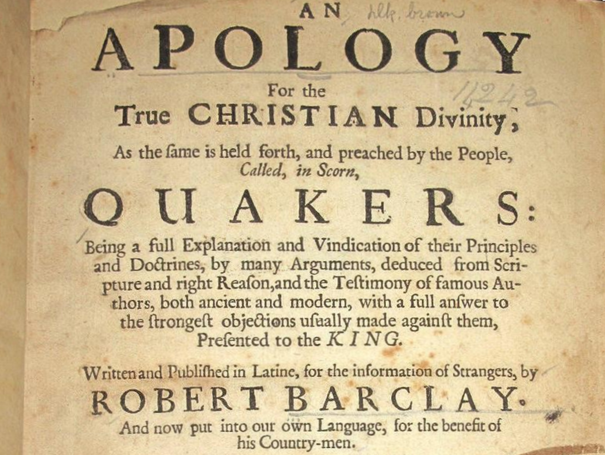

Apologie von Robert Barclay in der Übersetzung von 1776
=======================================================



Der Text basiert auf die Digitalisierung von Google und der OCR von Google.
Der Eingescannte Text ist eine übersetzung von 1776. Es gibt noch eine ältere
übersetzung von 1684. Diese von 1776 scheint mir aber die besser
verständlichere. 

### Grundsätze und Konzepte der Edition ###

* Der Text wurde/wird behutsam in der Rechtschreibung soweit angepasst,  
  das es der Lesbarkeit dient.
* Die Ausgabe von 1776 hat sehr viele Randbemerkungen
  die die Ausgabe von 1684 nicht hat. Diese sind in aller Regel aber nur 
  Zusammenfassungen der Kernaussagen des eigentlichen Textes. Bieten
  also keinen substanziellen Mehrwert und werden deshalb hier auch nicht
  übernommen.
* [Index](INDEX.md)

Lizenz
------

<a rel="license" href="http://creativecommons.org/licenses/by-sa/4.0/">

</a>
<br />
This work is licensed under a
<a rel="license" href="http://creativecommons.org/licenses/by-sa/4.0/">
Creative Commons Attribution-ShareAlike 4.0 International License
</a>.

Für Beitragende
---------------

### Quellen ###

* [OCR and scan picures on google.de/books ](https://www.google.de/books/edition/Robert_Barclay_s_Apologie_oder_Vertheidi/hb5jAAAAcAAJ?hl=de&gbpv=0&kptab=overview)
* [About the author (R. Barclay)](https://de.wikipedia.org/wiki/Robert_Barclay_(Qu%C3%A4ker))

### Formatierung ###

Der Text wurde/wird mit Markdown gesetzt. Im Maktdown werden die Zeilenlänge des 
Originals beibehalten, um so Textstellen Leichter mit den Scanns des originals
vergleichen zu können. Die Seitenwechsel des Originals werden als HTML-Kommentar
im Makrdown vermerkt. Die Quelle-Datei der OCR-Quell-Datei wird ebenfalls als
HTML-Kommentar vermerkt.

Jeder Paragraph bekommt eine Eigene Textdatei. Alle Makedown-Dateien ligen in 
gleichen Verzeichnis, um das Generieren des eBooks zu vereinfachen.

### Scripts ###

PDF erstellen:

```bash
$ ./scripts/create_pdf
```

ePub (eBook) erstellen:

```bash
$ ./scripts/create_ebook
```

Clean-up-Skript:

```bash
$ ./scripts/cleanup
```

Hilfreiche Tools
----------------

#### Unter Linux ####

- cal ihre (eBook-Reader)
- sigil (WYSIWYG eBook-Editor)


Bearbeitungsstände
------------------

| Kapitel | OCR-Übertragung | Formatierung | 1. Rechtschreibkorrektur | 2. Rechtschreibkorrektur | 
|---------|-----------------|--------------|--------------------------|--------------------------|
| Vorwort | :+1:            | :+1:         | :x:                      | :x:                      |
| 1       | :+1:            | :x:          | :x:                      | :x:                      |
| 2       | :+1:            | :x:          | :x:                      | :x:                      |
| 3       | :+1:            | :X:          | :x:                      | :x:                      |
| 4       | :+1:            | :X:          | :x:                      | :x:                      |
| 5       | :+1:            | :x:          | :x:                      | :x:                      |
| 6       | :+1:            | :x:          | :x:                      | :x:                      |
| 7       | :+1:            | :x:          | :x:                      | :x:                      |
| 8       | :+1:            | :x:          | :x:                      | :x:                      |
| 9       | :+1:            | :x:          | :x:                      | :x:                      |
| 10      | :+1:            | :x:          | :x:                      | :x:                      |
| 11      | :+1:            | :x:          | :x:                      | :x:                      |
| 12      | :+1:            | :x:          | :x:                      | :x:                      |
| 13      | :+1:            | :x:          | :x:                      | :x:                      |
| 14      | :+1:            | :x:          | :x:                      | :x:                      |
| 15      | :+1:            | :x:          | :x:                      | :x:                      |


